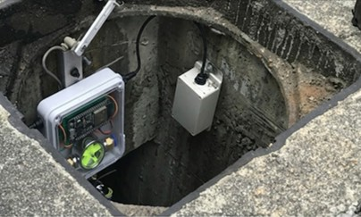
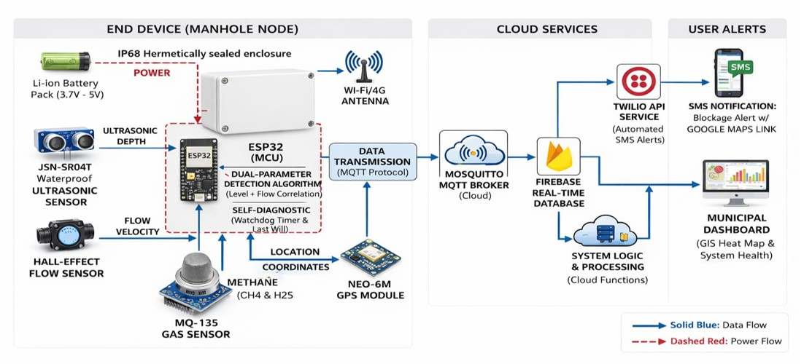

# Smart IoT-Based Drainage Blockage Detection and Alert System

A low-cost IoT sensor network that monitors urban drainage in real time and alerts municipal teams before a blockage turns into a flood.


**Developer:** Khaviya A · Panimalar Engineering College, Poonamallee, Chennai

---

## Why this project exists

Chennai floods almost every monsoon, and it's rarely because of the rain alone. Drains get choked with plastic waste and silt long before the water rises, but nobody finds out until a street is already underwater. Municipal teams currently have no way to check a drain's condition without physically opening the manhole — which means blockages are discovered the same day as the flooding, not weeks before it.

This project puts a sensor node inside the manhole itself. It watches water level and flow continuously, tells a real blockage apart from ordinary heavy rain, and texts a response team the moment something needs attention — GPS pin included, so nobody has to go check it in person first.

<p align="center">
  
  <br><sub>The sensor node mounted inside an actual manhole during field testing</sub>
</p>

---

## How the detection logic works

A single water-level sensor can't tell the difference between heavy rainfall and a blockage — both raise the water level. The trick is watching **flow** at the same time. When it's raining hard, the level rises but water is still moving through the pipe at a normal rate. When the drain is actually blocked, the level rises but flow drops to almost nothing, because the water has nowhere to go. That gap between the two readings is what triggers an alert, and it's also what keeps the system from sending a false alarm every time it rains.

If the gas sensor picks up dangerous methane or H₂S levels at the same time, that manhole gets flagged as unsafe to enter on the dashboard — independent of the blockage logic — so sanitation crews know before they lift the cover, not after.

---

## System architecture

<p align="center">
  
</p>

<table>
<tr>
<td valign="top" width="33%">

**End device — manhole node**

- JSN-SR04T waterproof ultrasonic sensor — water depth
- Hall-effect flow sensor — flow velocity
- MQ-135 gas sensor — methane & H₂S
- Neo-6M GPS module — location coordinates
- Li-ion battery pack, IP68 hermetically sealed enclosure

</td>
<td valign="top" width="33%">

**Edge processing**

ESP32 runs the dual-parameter detection algorithm (level + flow correlation) locally, with a self-diagnostic watchdog timer and MQTT last-will, so the node only transmits when something's actually worth reporting and recovers on its own if it locks up.

</td>
<td valign="top" width="34%">

**Cloud & alerts**

- Data goes out over MQTT to a Mosquitto broker, which holds up better than plain HTTP on weak, intermittent underground connections
- Firebase Realtime Database stores readings and runs the system logic
- Twilio sends an SMS alert with a Google Maps link; Firebase also powers the municipal GIS dashboard

</td>
</tr>
</table>

---

## Enclosure design

<p align="center">
  
  <br><sub>3D model of the IP68 enclosure — internal layout of the ESP32 board and sensor connections</sub>
</p>

Electronics don't usually last long in a sewer. Submersion, corrosive gas, and zero access to power are the three things that kill most prototypes before they ever get field-tested — so each one got a specific design answer.

| Spec | Detail |
|---|---|
| **Submersion rating** | IP68, sealed up to 1.5m, PG7 nylon cable glands at every wire entry |
| **Corrosion resistance** | Industrial-grade JSN-SR04T, holds up against sulfuric acid vapor that degrades standard sensors within months |
| **Battery life** | 6–9 months per charge, from running the ESP32 in deep sleep between readings |
| **Cost per unit** | ~₹3,500, sensors and enclosure included |


---

## Where this fits into bigger goals

Beyond the immediate flood-prevention angle, the project lines up with a few UN Sustainable Development Goals:

| Goal | How this project contributes |
|---|---|
| 🌊 Clean Water & Sanitation | Stops sewage from backing up into clean water sources during floods |
| 🏙️ Sustainable Cities | Keeps roads and transit usable instead of paralyzed by waterlogging |
| 🩺 Good Health & Well-being | Removes the need for sanitation workers to manually check or enter manholes, which is how a lot of preventable injuries happen |
| 🌍 Climate Action | Gives cities a way to adapt existing infrastructure to heavier, more frequent rainfall |

---

## Repository layout

```
smart-drainage-iot/
├── firmware/             ESP32 code — sensor reads, blockage logic, MQTT
├── dashboard/            Firebase dashboard (GIS map of all nodes)
├── alerts/               Twilio SMS integration
├── hardware/             Bill of materials and enclosure design notes
├── docs/                 Architecture notes, images, research references
└── scripts/              Setup utilities
```

---

## Where things stand right now

The system design, sensor selection, architecture, and enclosure spec are complete — that's what's documented in this repo. The firmware  is scaffolded with the full program structure and clearly marked TODOs, but the sensor drivers, MQTT integration, and dashboard still need to be built out.

- [x] Problem research and literature review
- [x] System architecture
- [x] Hardware selection and bill of materials
- [x] Enclosure durability design (IP68)
- [x] SDG impact mapping
- [ ] ESP32 firmware implementation
- [ ] Firebase dashboard
- [ ] Twilio SMS integration
- [ ] Field prototype testing

---

## Research this was based on

A few papers shaped specific design decisions was researched for full citations. The dual-sensor logic in particular came out of reading how other IoT flood-management systems handled the false-alarm problem during heavy rainfall.

---

## Developer

**Khaviya A**
Panimalar Engineering College, Poonamallee, Chennai

## License

[MIT](LICENSE)
